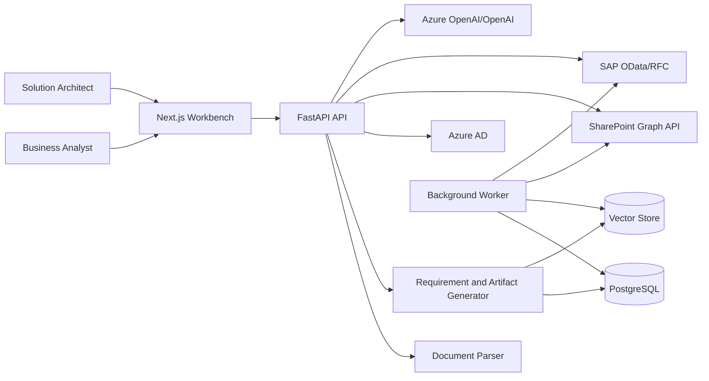
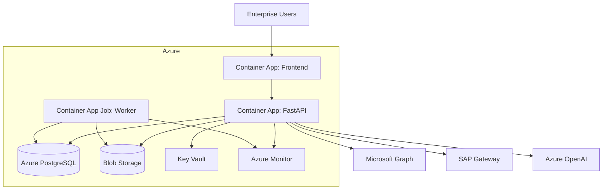

# QuickScribe Architecture

## Executive Summary

QuickScribe converts BRDs, SOPs, process documents, SharePoint files, SAP process documents, Excel sheets, and Nagare JIT sequence workflows into governed implementation artifacts. It produces requirements, architecture, database schemas, API designs, UI plans, validation rules, integrations, tests, deployment steps, risks, and assumptions.

## Context Diagram

## Deployment Diagram

## Security

- OAuth2 with Azure AD for enterprise authentication.
- JWT bearer validation at the API boundary.
- RBAC permissions for documents, generated solutions, integrations, and admin operations.
- Key Vault for SAP, SharePoint, OpenAI, Pinecone, and database secrets.
- Append-only audit logs for document ingestion, generation, approval, export, and integration calls.

## AI Agent Design

The agent workflow is:

1. Retrieve SharePoint or uploaded documents.
2. Normalize and chunk content.
3. Create embeddings with Azure OpenAI or OpenAI.
4. Store vectors in Pinecone, ChromaDB, or pgvector.
5. Retrieve top relevant chunks for a user question.
6. Generate source-grounded answer with citations.
7. Persist conversation history, citations, and token usage.

## SAP Integration

- Prefer SAP OData for material, supplier, plant, production sequence, purchase order, delivery, and inventory reads.
- Use RFC connector only when required data is unavailable through released OData APIs.
- Use idempotency keys, correlation IDs, and SAP document status reconciliation for write flows.

## Nagare JIT Logic

- Release call-offs when production sequence enters the firm horizon.
- Calculate delivery windows from line requirement time, supplier lead time, unloading time, and safety buffer.
- Block release on missing supplier mapping, inactive material, duplicate sequence, invalid window, or negative inventory projection.
- Measure sequence delivery adherence, supplier acknowledgment SLA, inventory accuracy, and line stop incidents.

